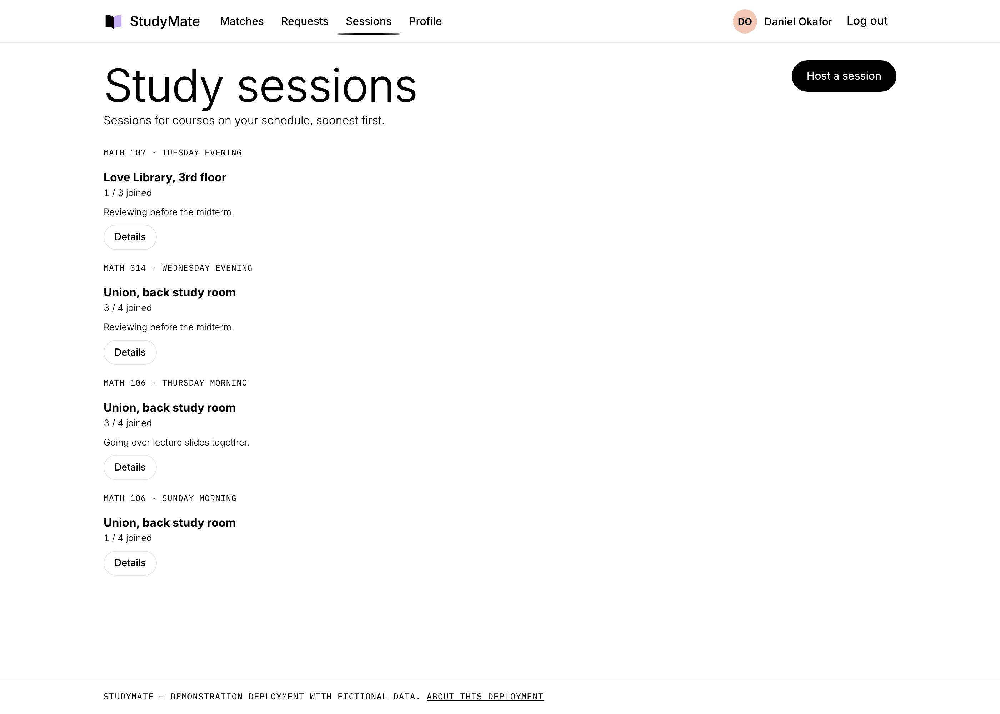
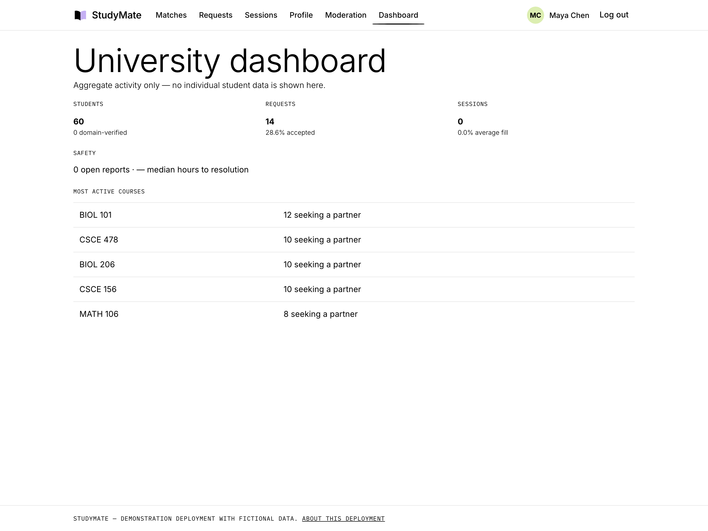

# StudyMate

Match college students to study partners in the courses they are actually taking,
and show the reasoning behind every match.


**Live demo:** <https://study-mate-6g24.onrender.com>
(the free tier sleeps after 15 minutes idle — the first load can take about a minute)

---

## What it does

Most "find a study partner" tools are a directory with a search box. StudyMate is a
matcher: a student enters their courses, their weekly availability and how they like
to work, and the app scores every other student against them and returns a ranked
deck of candidates — restricted to their own university, so the deck is never full of
people you could never actually meet.

The score itself is never shown. What you see instead is a **Great Match** or
**Strong Match** badge for the strongest candidates, or a plain unlabeled card for
everyone else — there is deliberately no "weak match" label. Every card carries the
concrete reasons behind it, in plain language.


Candidates arrive one at a time so a decision is a single choice rather than a
comparison across a table. Drag a card right to connect or left to skip; it tilts,
lifts and shows the decision before you commit to it. On a trackpad a two-finger
swipe does the same thing without holding a click — the browser's own
swipe-to-go-back is suppressed over the card so the gesture belongs to the deck.

Three cards are rendered as a real stack, so a decision is instant: the card leaves,
the next one is already behind it, and the choice posts in the background. The page
never reloads between candidates.

Everything the swipe does, the two buttons and the <kbd>C</kbd> / <kbd>N</kbd>
shortcuts also do. The gesture is layered on top of ordinary form posts, so the deck
still works with JavaScript off. With `prefers-reduced-motion` set the card still
follows your finger, but the rotation, lift and fly-off are dropped.

The same ranking is also available in full, so the ordering itself is visible:


---

## How the matching works

Two students are only ever compared if they share a **university** — that filter runs
before anything else and cannot be outweighed by any amount of course overlap. A course
only counts toward a match when **both** students have switched it on: your schedule is
every course you're taking, but matching uses only the ones you've flagged as wanting a
partner for. Sitting in the same lecture as someone who isn't looking for company is not
a match signal.

Within that pool, `MatchScorer` compares students across four dimensions. The
weighting reflects what makes a study partnership work in practice: being in the same
course matters far more than having a similar personality, and being free at the same
time is a prerequisite for meeting at all.

| Dimension | Points | Notes |
|---|---|---|
| Shared courses | 25 each, capped at 60 | The dominant signal |
| Overlapping availability | 4 per shared block, capped at 20 | Day + morning/afternoon/evening |
| Study style | up to 15 | Noise (6), pace (5), group size (4) |
| Same major | 5 | A weak signal; shared courses already capture most of it |
| **Total** | **100** | |

Noise and pace award partial credit for adjacent answers — someone who wants silence
and someone who wants quiet can work together, someone who wants silence and someone
who wants discussion cannot. Group size is compatible when both agree or either is
flexible.

The 0-100 score drives the ranking and decides which of two tiers a card gets —
**Great Match** at 75+, **Strong Match** at 55+ — but the number itself is never
rendered anywhere in the interface. What is shown is the reasoning: every point a
candidate earns is attached to a `MatchReason` carrying its own plain-language text,
enforced by a test that walks all 729 combinations of the three style preferences and
checks the reasons still sum to the score, even though that sum is never displayed.

The scorer is deliberately free of Entity Framework so the ranking logic can be
tested directly. `MatchService` adds the database query, the university filter, and
the exclusion rules: never the viewer, never anyone already involved in a request in
either direction, and never anyone the viewer has passed on.

---

## Running it locally

Requires the [.NET 8 SDK](https://dotnet.microsoft.com/download/dotnet/8.0). No
database server is needed — it uses SQLite, and the file is created on first run.

```bash
git clone https://github.com/Ssavan99/study-mate.git
cd study-mate
dotnet run --project StudyMate/StudyMate.csproj
```

Then open <http://localhost:10000>. The database is created, migrated and seeded with
60 fictional students automatically, so the app is populated the moment it starts.
Pick any demo profile on the landing page to sign in without registering.

Run the tests:

```bash
dotnet test
```

Or build and run the container the deployment uses:

```bash
docker build -t studymate . && docker run -p 10000:10000 studymate
```

---

## The rest of the app

Profiles drive the matching, so the schedule and a weekly availability grid are the
substance of the profile page. Courses belong to a university — different schools
genuinely use different abbreviations and numbering, so "CSCE 155" at one school and
"CS 227" at another are separate courses, and you only ever see your own school's
catalog. You add courses through a department → course pair of dropdowns, filled from
the university's real catalog — for Nebraska-Lincoln that is **171 departments and
7,712 courses**, imported from the university's own course bulletin.

There is deliberately no way to type a course in by hand. Free-text entry was how the
same class ended up in the catalog three times under three spellings, which quietly
splits the pool of people you could have matched with. If a course genuinely is
missing you can request it: the request goes to moderation and only becomes a course
once it is approved, so nothing unvetted reaches anyone else's dropdown.

Each course on your schedule has its own switch for whether you actually want a study
partner in it.

A profile picture is optional; anyone who hasn't set one gets a deterministic
initials-on-color avatar instead, the same pattern GitHub and Slack use for a default:


Connecting sends a study request, which the other student accepts or declines.

Once it is accepted, the app says **when the two of you are actually free**. It
already knew — availability overlap is part of the score — so stopping at
"accepted" left the most useful thing it had unsaid. Suggestions are ranked by
how soon they come round rather than by how much overlap they represent, because
being told you are both free tomorrow afternoon is worth more than the identical
slot next Sunday. Shared courses are attached as context where they exist, and
their absence never withholds the times:


`StudySessionSuggester` takes the current day as an argument instead of reading
the clock, so its ranking is directly testable for any day of the week, and like
`MatchScorer` it holds no reference to Entity Framework. It reuses the overlap
logic rather than restating it.

---

## Study sessions

Matching one-to-one only goes so far — often what you actually want is three or four
people from the same course in the same room. A session names a course, a day and
block, somewhere to meet and how many people it holds. Anyone at your university
taking that course can join while there is room.



Sessions are ranked the same way suggested times are: by how soon they come round,
not by when they were created. `SessionScheduler` holds the ranking, capacity and
eligibility rules and, like `MatchScorer`, has no reference to Entity Framework, so
those rules are unit-tested directly. Leaving a session you host cancels it — the
people who joined can see that it was cancelled rather than finding it silently gone.

## Blocking, reporting and moderation

Blocking is mutual and total: a blocked pair never see each other again in the deck,
the ranked list, requests, suggested times or sessions. The exclusion lives in the
same place as the existing "never anyone you already passed" rules, so there is one
answer to who is allowed to see whom rather than a check per screen. Blocking also
withdraws any request still open between the two.

Reports carry a reason and go to a moderation queue where they can be dismissed or
acted on, with a note recorded either way. Nothing is ever surfaced to the person who
was reported.

## Admin dashboard

An institution asking whether this is worth adopting wants numbers, so there is a
dashboard: students registered and how many are domain-verified, matches reviewed,
requests sent and accepted, sessions created and how full they run, and open reports.



It shows aggregates only. Individual student data stays out of it — a dashboard for
running the service, not for watching the people using it.

---

## Built with

ASP.NET Core 8 MVC · C# · Razor · Entity Framework Core 8 · SQLite · Bootstrap 4 ·
xUnit · Docker

Course data comes from the [UNL course bulletin](https://bulletin.unl.edu/developers),
which publishes subjects and courses as JSON with no key or account required. It is
read once by an import step, never per request.

Authentication is cookie-based with passwords hashed via ASP.NET Core's
`PasswordHasher`. Signing in with an institutional account is the path that proves
which university a student belongs to: the provider returns an already-verified email
address, and its domain is matched against the domains registered for that university.
That means affiliation can be established without the app sending a single email.
Every provider is optional and activates only when its client id and secret are
configured — with none set the app runs normally and the demo profiles are the way in.

---

## Limitations

This is a demonstration deployment, and it is worth being specific about what that means.

- **The data is fictional.** All 60 students are generated. Any resemblance to real
  people is accidental.
- **The database resets whenever the service restarts.** The free hosting tier has no
  persistent disk, so accounts created through registration, requests sent, profile
  edits and uploaded profile photos are all lost on restart, redeploy, and after an
  idle spin-down. Within a session everything persists normally. The seeded data
  always returns intact.
- **Only Nebraska-Lincoln has a full catalog.** A university is a real record with
  its own recognised email domains and its own course list. UNL's is complete because
  its bulletin publishes course data openly; adding another school means importing
  its catalog the same way. Until that happens, students there can only reach courses
  through the request queue.
- **The catalog is a snapshot, not a feed.** It is imported once and checked in, so
  the app has no runtime dependency on the university and works offline and on a cold
  start. Course listings change once a semester; re-running the import is a
  deliberate act, not something that happens on its own.
- **The first request after an idle period takes about a minute.** The free tier spins
  the service down after 15 minutes without traffic.
- **It is still not built to hold real personal data.** Blocking, reporting and a
  moderation queue exist, but there is no password reset, no appeals process, and no
  retention policy. Affiliation is proved by signing in with an institutional account
  and checking the verified email's domain — there is no independent email
  verification of an address the provider has not already confirmed.
- **GitHub sign-in needs its own setup.** A fresh clone has no OAuth app behind it. To
  enable it, register an OAuth app with a callback of `/signin-github` and supply
  `Authentication__GitHub__ClientId` and `Authentication__GitHub__ClientSecret` as
  environment variables. Without them the app runs normally and the button is hidden.
- **Matching is unweighted by feedback.** Scores come from a fixed rubric; nothing
  learns from which connections were actually accepted.

Chat and notifications are still deliberately out of scope. Without somewhere to
send a message and someone to answer it, both are scaffolding for a conversation the
app does not host — connecting people and telling them when to meet is the part worth
doing well.

---

## License

[MIT](LICENSE)
