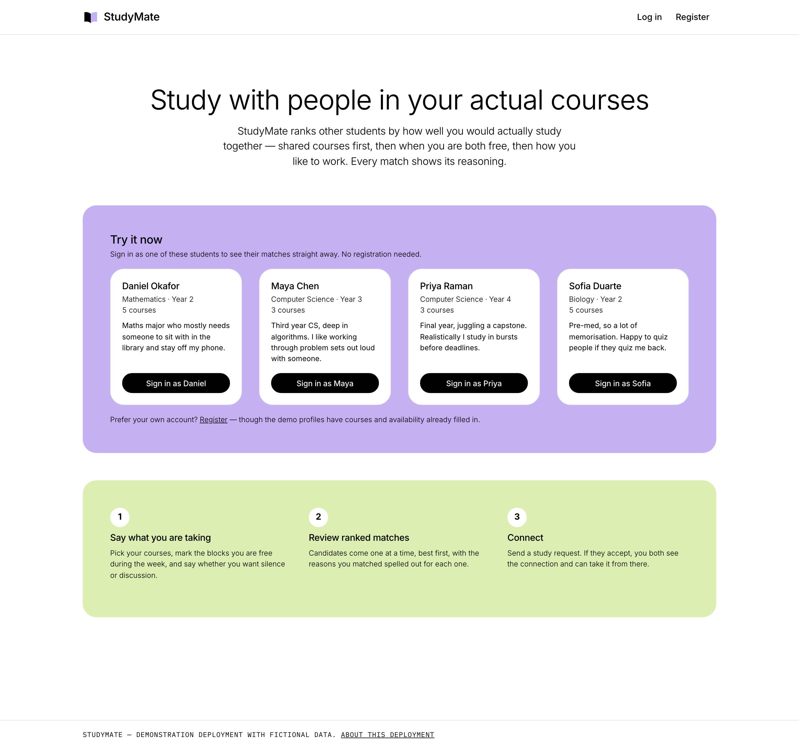
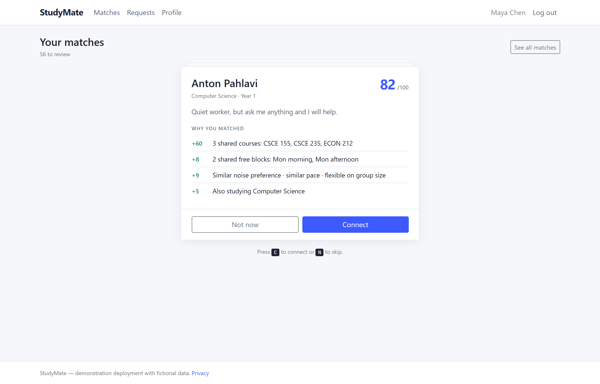
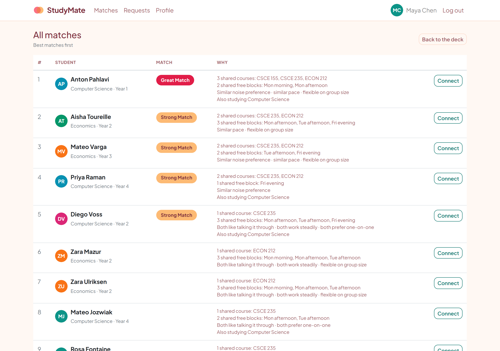
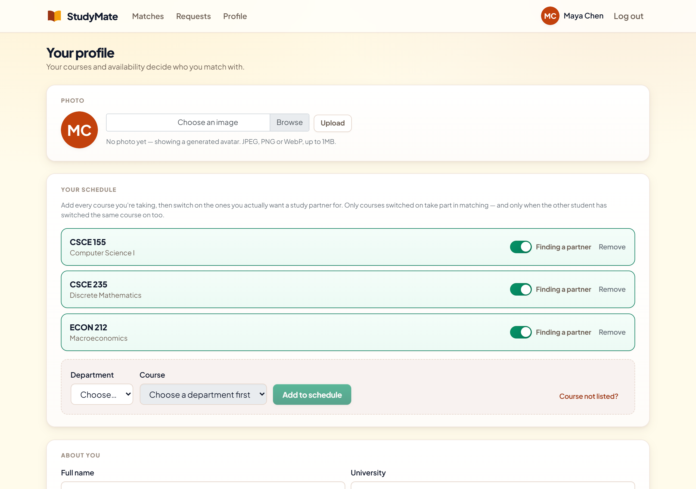
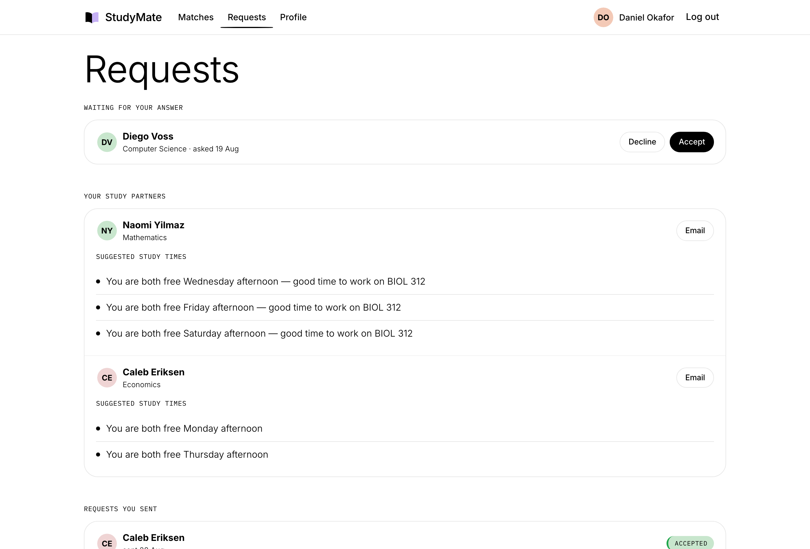

# StudyMate

Match college students to study partners in the courses they are actually taking,
and show the reasoning behind every match.



**Live demo:** <https://study-mate-6g24.onrender.com>
(the free tier sleeps after 15 minutes idle — the first load can take about a minute)

---

## What it does

Most "find a study partner" tools are a directory with a search box. StudyMate is a
matcher: a student enters their courses, their weekly availability and how they like
to work, and the app scores every other student against them and returns a ranked
deck of candidates.

Each candidate is scored out of 100, and the score is broken down into the reasons
that produced it — never presented as an unexplained number.



Candidates arrive one at a time so a decision is a single choice rather than a
comparison across a table. The same ranking is also available in full, so the
ordering itself is visible:



---

## How the matching works

`MatchScorer` compares two students across four dimensions. The weighting reflects
what makes a study partnership work in practice: being in the same course matters
far more than having a similar personality, and being free at the same time is a
prerequisite for meeting at all.

| Dimension | Points | Notes |
|---|---|---|
| Shared courses | 25 each, capped at 60 | The dominant signal |
| Overlapping availability | 4 per shared block, capped at 20 | Day + morning/afternoon/evening |
| Study style | up to 15 | Noise (6), pace (5), group size (4) |
| Same major | 5 | A weak signal; shared courses already capture most of it |
| **Total** | **100** | |

Noise and pace award partial credit for adjacent answers — someone who wants silence
and someone who wants quiet can work together, someone who wants silence and someone
who wants discussion cannot. Group size is compatible when both agree or either is
flexible.

Every point a candidate earns is attached to a `MatchReason` carrying its own text,
so the interface can always explain the total. This is enforced by a test that walks
all 729 combinations of the three style preferences and asserts the reasons sum to
the score.

The scorer is deliberately free of Entity Framework so the ranking logic can be
tested directly. `MatchService` adds the database query and the exclusion rules:
never the viewer, never anyone already involved in a request in either direction,
and never anyone the viewer has passed on.

---

## Running it locally

Requires the [.NET 8 SDK](https://dotnet.microsoft.com/download/dotnet/8.0). No
database server is needed — it uses SQLite, and the file is created on first run.

```bash
git clone https://github.com/Ssavan99/study-mate.git
cd study-mate
dotnet run --project StudyMate/StudyMate.csproj
```

Then open <http://localhost:10000>. The database is created, migrated and seeded with
60 fictional students automatically, so the app is populated the moment it starts.
Pick any demo profile on the landing page to sign in without registering.

Run the tests:

```bash
dotnet test
```

Or build and run the container the deployment uses:

```bash
docker build -t studymate . && docker run -p 10000:10000 studymate
```

---

## The rest of the app

Profiles drive the matching, so course selection and a weekly availability grid are
the substance of the profile page:



Connecting sends a study request, which the other student accepts or declines:



---

## Built with

ASP.NET Core 8 MVC · C# · Razor · Entity Framework Core 8 · SQLite · Bootstrap 4 ·
xUnit · Docker

Authentication is cookie-based with passwords hashed via ASP.NET Core's
`PasswordHasher`. Sign-in with GitHub is included as an optional third path and
activates only when a client id and secret are configured.

---

## Limitations

This is a demonstration deployment, and it is worth being specific about what that means.

- **The data is fictional.** All 60 students are generated. Any resemblance to real
  people is accidental.
- **The database resets whenever the service restarts.** The free hosting tier has no
  persistent disk, so accounts created through registration, requests sent and
  profile edits are lost on restart, redeploy, and after an idle spin-down. Within a
  session everything persists normally. The seeded data always returns intact.
- **The first request after an idle period takes about a minute.** The free tier spins
  the service down after 15 minutes without traffic.
- **It is not built to hold real personal data.** There is no email verification, no
  password reset, no moderation tooling and no abuse reporting. Those are prerequisites
  for a real deployment and are deliberately out of scope here.
- **GitHub sign-in needs its own setup.** A fresh clone has no OAuth app behind it. To
  enable it, register an OAuth app with a callback of `/signin-github` and supply
  `Authentication__GitHub__ClientId` and `Authentication__GitHub__ClientSecret` as
  environment variables. Without them the app runs normally and the button is hidden.
- **Matching is unweighted by feedback.** Scores come from a fixed rubric; nothing
  learns from which connections were actually accepted.

Chat, group study sessions, notifications and moderation were considered and left
out on purpose, to keep the scope to something that is actually finished.

---

## License

[MIT](LICENSE)
